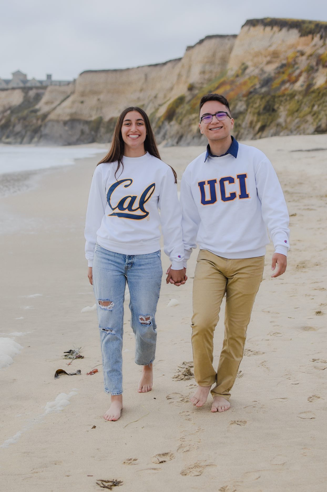
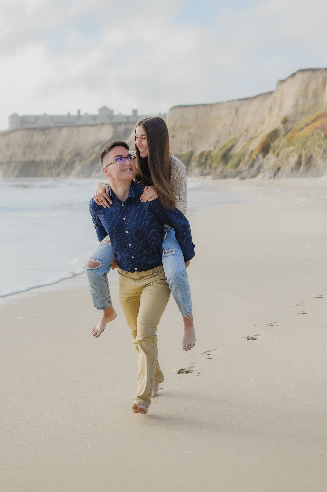
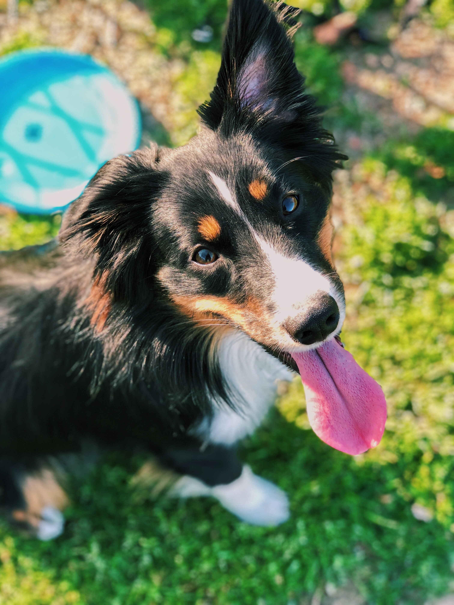
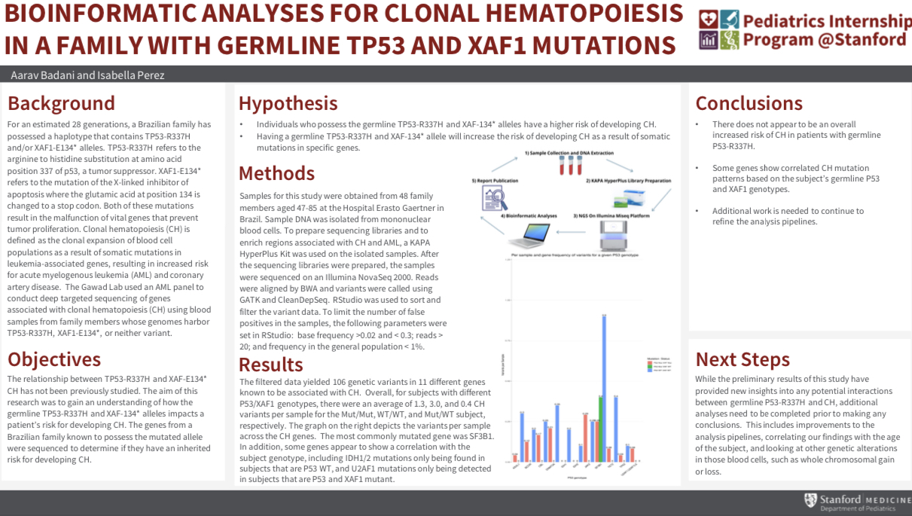
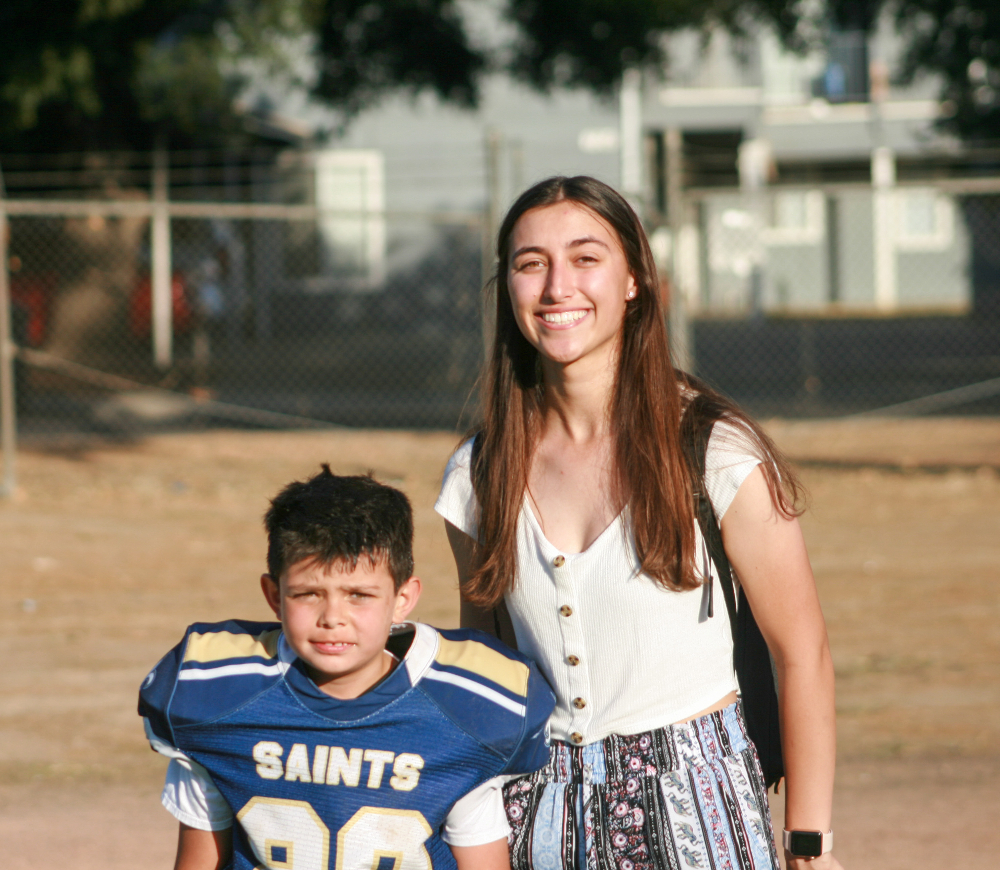

# Portfolio

## Isabella Perez

### Education
- Fred C. Beyer High School (2018 - 2022)
    - Top 5% of class.
- University of California, Berkeley (2022 - 2026)          
    - Double Major in Molecular Cell Biology and Marine Science

 
 
 
### Personal Life
 
 I have been in a relationship with my boyfriend, Emilio, since eighth grade. We're best friends, and I could not imagine life without him.
 
  
  
 I also have my own dog, Dexter, who I love dearly.
 
 
  
  
 During my free time I enjoy reading, drawing, working out, editing videos, or taking photos.
 
[https://www.youtube.com/embed/v04N0no2fAU](https://youtu.be/v04N0no2fAU)
 
 This is a video I edited of photos I took for a boy I babysat.
 
### Awards
 
- Regents' and Chancellor's Scholar (University of California, Berkeley), 2022 - 2026
- SEED Honors Scholar (University of California, Berkeley), 2022 - 2026
- AP Scholar Award (National), 2020 - 2021
- North Coast Section Scholar Athlete (4.00+ GPA, Golf) (Regional), 2018 - 2021
- 1st, 4th, 5th place Science Olympiad Events (Regional), 2020 - 2021

### Research Experience

**Harvard University Pre-College, Summer 2020**
- Took two courses on oncology: "Introduction to Cancer: Diving into Research"
and "Molecular Oncology: Unravelling Molecular Biology Techniques" with Dr.
Julie Konge.
- In the first course, I learned about the basics of cancer such as apoptosis, tumor
angiogenesis, the p53 tumor supressor, and the difference between malignant
and benign tumors.
- In the second course, I worked with real case studies to identify the severity of
cancers and their inheritance patterns.

**Pediatric Internship at Stanford University, Summer 2021**
- Spent 15 hours a week working on research project and 5 hours a week on
professional development, networking, research practices, and college
applications workshops.
- Learned RStudio coding for bioinformatic analyses.
- Worked with the Gawad Lab and a partner to develop a research poster on
clonal hematopoesis and mutated XAF1 and TP53 alleles in a Brazilian family.

### Work Experience

**Nanny, 2020 - 2022**
- Regularly cared for four children aged 2-14 to support working parents.
- Attended their sporting events, took them to practices, oversaw them on vacations,
and made them healthy snacks.
- Helped the children with homework during the school year and prepared them for
the new school year by spending additional hours over the summer working with
them on anticipated curriculum.
- Raised the grades of one and taught another to read.

**Aced It! Tutoring, 2020 - 2021**
- Founded company, Aced It! Tutoring, during COVID-19 pandemic and hired five
subject-specific tutors who engaged with students virtually daily.
- Built a website, billed clients, donated school supplies to local Lutheran church,
and raised the grades of thirteen diverse students.
- Mentored special needs pupils with autism, ADHD, and behavioral issues.
